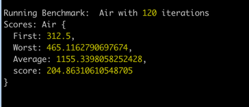
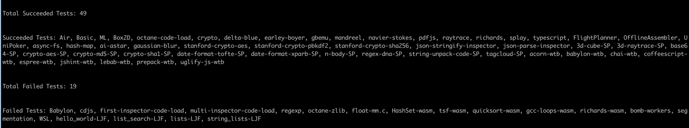

# Running JetStream On Node

## Prerequisites

- Node.js `v22.12.0`
- npm

## Installation

1. Clone the repository
2. Navigate to the repository directory
3. Run `npm run jetstream-node` to start the JetStream on NodeJs

## Things to Note

1. The tests are run in the order they are listed in the `JetStreamDriverWithNode.js` file.
2. All the tests will run at once. currently there is not way to run a single test.

## Output

1. The results are printed in the console for each test like this.

2. Final result will be printed at the end.

